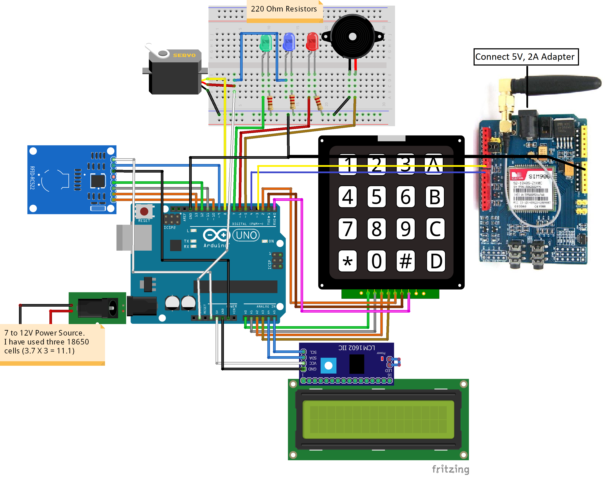
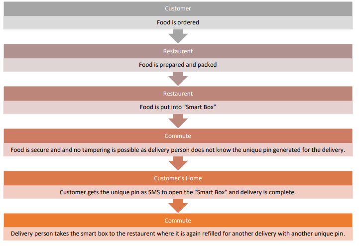

# SmartBox-for-delivery
### Ardrino controlled smart box with two factor authentication for delivery of food and other sensitive items. 

#### Idea:
- The idea is to make a delivery box which once closed and locked by the restaurant, can only be opened by the intended customer using a secure key.
- We can use this product to store personal belongings like ornaments, important documents and money kept in offices and in organisations also.

##### Below is the pin diagram:

  

##### The project requires following hardware components:
- Arduino
- Buzzer _(Optional)_
- RFID Kit module
    - RFID Sensor
    - RFID Tag(s)
- Half size breadboard _(or any breadboard)_
- Micro servo motor
- 4x4 keyboard
- 6V battery _(Optional incase you want to run the project independent of a computer)_
- 220ohm registers _(Optional)_
- LEDs _(Optional)_
- GSM module _(Optional)_
- USB cable Male to Male _(From computer to Ardurino)_

##### Following flowchart is for a layman:

##  __Feel free to make pull requests__
